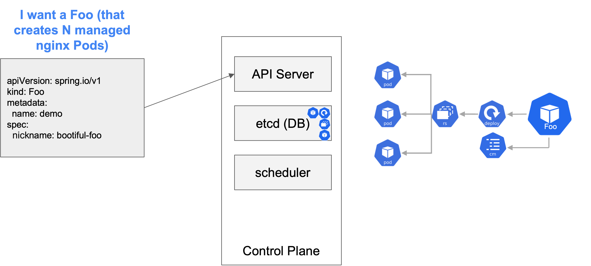

The **custom controller we'll build in this workshop is for a Foo**

A Foo greets you with an individual message.
As this workshop is focused on how to build a custom Kubernetes controller with Spring Boot, the implementation of the business functionality is kept as simple as possible.
For **every Foo**, the custom controller will create a **`Deployment` resource of an NGINX webserver** and a **`ConfigMap` containing the individual greeting as HTML**. 

 Let's walk through what actually happens.

First off, when you communicate with Kubernetes, everything talks through the API server.

The API server then saves the request to the control plane database, which is typically etcd. And this is why Josh Long says Kubernetes is just a database without any action behind it – you need something to ask the API server about actually doing something with the resources and if there are any requests related to them.

For instance, if we want to have a Foo. This then gets added to the database. If there's no controller, this is where things end. The way we will be creating Foo is that Foo will create a Deployment, which uses the Deployment controller. And this gets added to the database. The deployment controller then will inquire with the API server and know there was a request for a new Deployment and then that continues down through the ReplicaSet controller. In our specific case, we will be using the NGINX image. These controllers compare the actual state to the desired state.

Then the scheduler, which is another type of controller, assigns nodes for these pods. Just a bit of controller galore.

In the next section, you'll learn how we're able to make Kubernetes aware of our Foo.