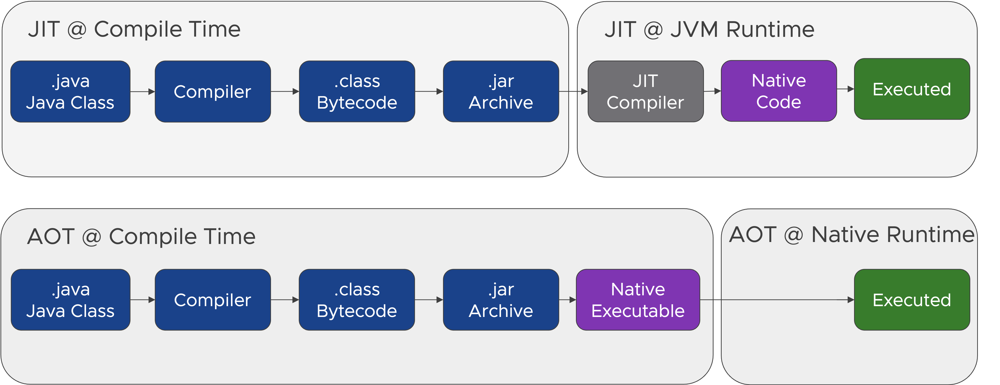
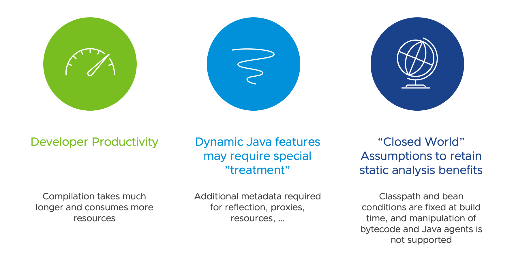

Cloud-native applications are disposable, which means they **can be started or stopped rapidly**. An application cannot scale, deploy, release, or recover rapidly if it cannot start rapidly and shut down gracefully. 

If we have a look at our controller's logs, we can see how long it took it to start.
```terminal:execute
command: kubectl logs -l app=foo-controller -c foo-controller | grep "Started"
clear: true
```
You will see something similar to this.


```
$ kubectl logs -l app=foo-controller -c foo-controller | grep "Started"
2023-08-22T05:47:55.352Z  INFO 1 --- [           main] i.s.controller.ControllerApplication     : Started ControllerApplication in 2.042 seconds (process running for 2.571)
```


We can also have a closer look at the CPU and memory consumption.
```terminal:execute
command: kubectl top pods -l app=foo-controller --containers
clear: true
```
You will see something similar to these results.


```
$ kubectl top pods -l app=foo-controller --containers
POD                       NAME                CPU(cores)   MEMORY(bytes)   
foo-controller-f686bb89f  foo-controller      2m           263Mi
```


In the case, your **application has to recover or scale rapidly, startup time and compute resources become a concern**. If an application starts slowly, it might mean your app cannot scale fast enough to handle a sudden increase in demand, and **if it consumes a lot of resources (memory, CPU, etc.) and scales to a large degree, that means increased cost**.

Making sure we can **optimize both performance (start time) and resource consumption can be a game changer in the cloud**. 
Let's see how Spring solves this problem for you!

##### Just-in-Time vs Ahead-of-Time compilation
In **traditional** Java applications, **Java code is compiled into Java ‘bytecode’** and packaged into a JAR archive. The Java Virtual Machine **(JVM) then executes the Java program** contained in the Java Archive on the host platform **with a bytecode interpreter**. 

The **execution of Java bytecode by an interpreter is always slower** than the execution of the **same program compiled into a native machine language**. This problem is mitigated by **just-in-time (JIT) compilers**. 

A JIT compiler **translates Java bytecode into native machine language while executing the program for parts of a program that are frequently executed**. The translated parts of the program can then be **executed much faster**. This way, a **JIT compiler can significantly speed up the overall execution time**. 

The **downside** is that the JIT compilation **impacts the application startup time**, and a Java program running on a Java Virtual Machine is always **more resource-consuming than native execution**. 

With the **ahead-of-time compilation** of the Java code to a standalone executable, called a **native image**, you are able to mitigate these problems and make your **application start faster and consume fewer resources**.



###### What are native images?
- Standalone executables of ahead-of-time compiled Java code
- Includes the application classes, classes from its dependencies, runtime library classes, and statically linked native code from JDK
- Runs without the need for a JVM, necessary components like for memory management, thread scheduling, and so on are included in a runtime system called "Substrate VM" 
- Specific to the OS and machine architecture for which it was compiled
- Requires fewer resources, is smaller, and faster than regular Java applications running on a JVM

The only way to do this at present is to use **GraalVM**, but in the future, similar technology may be available, like the OpenJDK Project Leyden. 

##### GraalVM - A high-performance JDK distribution
GraalVM is a high-performance JDK distribution by Oracle designed to **execute applications written in Java and other JVM languages** while **also providing runtimes for JavaScript, Ruby, Python, and a number of other popular languages**, which is made possible by **GraalVM's Truffle language implementation framework**.

GraalVM **adds an advanced just-in-time (JIT) optimizing compiler**, which is written in Java, to the HotSpot Java Virtual Machine.

GraalVM offers **three runtime modes**:
- JVM runtime mode
- Native image 
- Java on Truffle for those none JVM languages


##### Tradeoffs between JVM and native images
**Native images** are able to **improve both the startup time and resource consumption** for your applications deployed on a serverless runtime, but you have to keep in mind that there are some trade-offs compared to the JVM.

They **offer lower throughput and higher latency** because they can't optimize hot paths during runtime as much as the JVM can. 
The **compilation takes much longer and consumes more resources**, which is bad for developer productivity. 
Finally, the **platform is also less mature**, but it evolves and improves quickly.



For GraalVM native images, all the bytecode in the application needs to be **observed** and **analyzed** at **build time**.

One area the analysis process is responsible for is determining which classes, methods, and fields need to be included in the executable. The **analysis is static**, so it might need some configuration to correctly include the parts of the program that use dynamic features of the language.

However, this analysis cannot always completely predict all usages of the **Java Reflection, Java Native Interface (JNI), Dynamic Proxy objects (java.lang.reflect.Proxy)**, or **classpath** resources (**Class.getResource)**. 

**Undetected usages of these dynamic features need to be provided to the native-image tool in the form of configuration files.**

To **make preparing these configuration files easier** and more convenient, GraalVM provides an **agent that tracks all usages of dynamic features of execution on a regular Java VM**. 
During execution, the agent interfaces with the Java VM to intercept all calls that look up classes, methods, fields, resources, or request proxy accesses.

##### Spring Boot's GraalVM Native Image Support

**Spring Boot 3 added support for compiling Spring applications to lightweight native images using the GraalVM native-image compiler.**

Spring Boot applications are typically dynamic, and configuration is performed at runtime, but when creating native images with GraalVM, **a closed-world approach is used to retain static analysis benefits**. This means implies the following restrictions:
- **The classpath is fixed and fully defined at build time**
- The **beans defined in your application cannot change at runtime**. So the `@Profile` annotation, profile-specific configuration, and Properties that change if a bean is created are not supported

When these restrictions are in place, it becomes possible for Spring to perform ahead-of-time processing during build-time and generate additional assets that GraalVM can use. 

You can **get started** very **easily by using start.spring.io to create a new project and adding the  Maven or Gradle GraalVM Native Build Tools plugin.**

**For Maven**, the `spring-boot-starter-parent` declares a `native` profile that configures the executions that need to run to create a native image. You can activate profiles using the `-P` flag on the command line.

The Spring Boot **Gradle plugin automatically configures AOT tasks when the GraalVM Native Image plugin is applied**. 
Let's add the `org.graalvm.buildtools.native` plugin to the controller. 
```editor:insert-lines-before-line
file: controller/build.gradle
line: 5
text: |1
     id 'org.graalvm.buildtools.native' version '0.9.23'
```

With the plugin, you're able to invoke the native image compiler from your build with the following commands for Maven and Gradle.
```
mvn -Pnative native:compile
gradle nativeCompile
```

**Spring Boot also includes buildpack support for native images directly** for both Maven and Gradle. Due to the auto-configured AOT tasks, **with Gradle, the bootBuildImage task will now generate a native image** rather than a JVM one **without any additional parameters**.
```
(cd ~/controller/ && ./gradlew bootBuildImage --imageName={{ registry_host }}/foo-controller-native)
```

Let's now see how the **controller performs as a native image**! 
As you learned, the compilation of native images takes much longer and consumes more resources. Therefore, it's already done for you.


The Kubernetes Java Client is available as a special version with AOT compilation support.
```editor:select-matching-text
file: ~/controller/build.gradle
description: Select Java client for Kubernetes dependency
text: |
     implementation 'io.kubernetes:client-java-spring-integration:18.0.1'
```
```editor:replace-text-selection
file: ~/controller/build.gradle
description: Replace with Java client for Kubernetes AOT dependency
text: |
     implementation 'io.kubernetes:client-java-spring-aot-integration:18.0.1'
```

You may still remember that we **used a YAML template which we loaded from the Classpath** in the Reconciler instead of programmatically building up the Deployment from scratch and that **undetected usages of classpath resources have to be provided to the native-image tool** in the form of configuration files.**

To provide this configuration to the native-image tool with Spring Boot, there is a `RuntimeHints API`.
It collects the need for reflection, resource loading, serialization, and JDK proxies at runtime. 
Several contracts are handled automatically during AOT processing. For cases that the **core container cannot infer**, you can **register such hints programmatically** by implementing the `RuntimeHintsRegistrar` interface. 
```editor:insert-lines-before-line
file: ~/controller/src/main/java/io/spring/controller/FooReconciler.java
line: 121
description: Add RuntimeHintsRegistrar implementation for resource hint
text: |2

      static class ResourceAccessHints implements RuntimeHintsRegistrar {

          @Override
          public void registerHints(RuntimeHints hints, ClassLoader classLoader) {
              hints.resources().registerPattern("deployment-template.yaml");
          }
      }
```
```editor:insert-lines-before-line
file: ~/controller/src/main/java/io/spring/controller/FooReconciler.java
line: 23
description: Add imports
text: |2
  import org.springframework.aot.hint.RuntimeHints;
  import org.springframework.aot.hint.RuntimeHintsRegistrar;
```

Implementations of this interface can be registered using `@ImportRuntimeHints` on any Spring bean or @Bean factory method.
```editor:insert-lines-before-line
file: ~/controller/src/main/java/io/spring/controller/ControllerConfiguration.java
line: 45
description: Register RuntimeHintsRegistrar implementation
text: |2

      @ImportRuntimeHints(FooReconciler.ResourceAccessHints.class)
```

If you have **classes that need binding** (mostly needed when serializing or deserializing JSON), most of the hints are automatically inferred, for example when accepting or returning data from a @RestController method. But when you work with WebClient or RestTemplate directly, you might need to use [@RegisterReflectionForBinding](https://docs.spring.io/spring-framework/docs/current/javadoc-api/org/springframework/aot/hint/annotation/RegisterReflectionForBinding.html) annotation.
In our case, we have to register the List classes of the resources we are using, as they are not directly referenced in the implementation.

```editor:insert-lines-before-line
file: ~/controller/src/main/java/io/spring/controller/ControllerConfiguration.java
line: 21
description: Register non directly used classes initialized via reflection
text: |2
  import io.kubernetes.client.openapi.models.*;
  import org.springframework.context.annotation.ImportRuntimeHints;
  import org.springframework.aot.hint.annotation.RegisterReflectionForBinding;

  @RegisterReflectionForBinding({ V1Foo.class, V1FooList.class })
```

After everything is prepared, let's update our deployment with the container image that is already built for you and find out how the startup time and resource consumption changed.
```terminal:execute
command: kubectl set image deployment/foo-controller foo-controller={{ registry_host }}/foo-controller-native
clear: true
```

You should be able to see that the startup time is dramatically reduced compared to the same application running on the JVM ...
```terminal:execute
command: kubectl logs -l app=foo-controller -c foo-controller | grep "Started"
clear: true
```
You will see something similar to this.

```
$ kubectl logs -l app=foo-controller -c foo-controller | grep "Started"
2023-08-22T05:24:37.120Z  INFO 1 --- [           main] i.s.controller.ControllerApplication     : Started ControllerApplication in 0.035 seconds (process running for 0.041)
```

... and the memory and CPU consumption is also reduced.
```terminal:execute
command: kubectl top pods -l app=foo-controller --containers
clear: true
```

You will see something similar to this.

```
$ kubectl top pods -l app=foo-controller --containers
POD                        NAME                CPU(cores)   MEMORY(bytes)   
foo-controller-6469688668  foo-controller      1m           60Mi
```



*Hint: VMware Tanzu offers Enterprise Support for Spring Boot Native Applications compiled with the BellSoft Liberica native image Kit which is based on GraalVM Open Source.*

###### A future solution: JVM Checkpoint Restore

Spring Framework 6.1 M1 integrates with checkpoint/restore as implemented by [Project CRaC](https://openjdk.org/projects/crac/) to reduce the startup and warmup times of Spring-based Java applications with the JVM. The CRaC (Coordinated Restore at Checkpoint) project researches the coordination of Java programs with mechanisms to checkpoint (make an image of, snapshot) a Java instance while it is executing and restoring it.